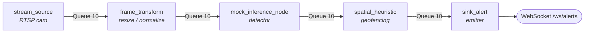

<div align="center">

# 🛰️ Netra-One Pipeline Engine

**A declarative, concurrent DAG execution engine for real-time surveillance pipelines**

*Compile → Validate → Execute, with backpressure, fault isolation and clean shutdown.*


</div>

---

## ✨ Highlights

- 🧩 **Declarative pipelines**: define a processing graph in YAML/JSON, no hardcoded stages.
- 🛡️ **Compiler-style validation**: topological sort, cycle detection, and I/O type checking *before* anything runs.
- ⚡ **Concurrent execution**: one `asyncio` task per node, connected by bounded queues.
- 🎞️ **Drop-oldest backpressure**: stale frames are evicted so memory stays bounded and live data stays fresh.
- 🧱 **Fault isolation**: a failing node logs a structured error and the pipeline keeps running.
- 📡 **Live telemetry & alerts**: per-node FPS / queue depth / error counts, plus a WebSocket alert stream.

---

## 📑 Table of Contents

1. [Architecture](#-architecture)
2. [Design Decisions](#-design-decisions)
3. [Quick Start](#-quick-start)
4. [Pipeline Configuration](#-pipeline-configuration)
5. [Node Types & Type Contract](#-node-types--type-contract)
6. [API Reference](#-api-reference)
7. [Load Test](#-load-test)
8. [Error Handling](#-error-handling)
9. [Testing](#-testing)
10. [Repository Structure](#-repository-structure)

---

## 🏗️ Architecture



**Lifecycle of a pipeline**

| Phase | What happens | Module |
|-------|--------------|--------|
| 1. Parse | YAML/JSON is loaded into a graph of nodes and edges | `pipeline_compiler.py` |
| 2. Validate | Duplicate IDs, unknown nodes/types, cycles, and I/O schema mismatches are rejected | `pipeline_compiler.py` |
| 3. Order | Kahn's algorithm produces an execution order | `pipeline_compiler.py` |
| 4. Execute | One async worker per node, bounded queues per edge | `engine.py` |
| 5. Serve | Health, compile, and alert endpoints | `server.py` |

---

## 🧠 Design Decisions

| Concern | Approach | Why |
|---------|----------|-----|
| **Topological sort** | Kahn's algorithm | Iterative, O(V+E), gives a deterministic execution order |
| **Cycle detection** | DFS with back-edge detection | Raises `CycleDetectedError` at compile time instead of deadlocking at runtime |
| **I/O validation** | Schema registry mapping node type → input/output type | Edge validation is a simple comparison, like type-checking function composition |
| **Concurrency** | `asyncio`, one task per node | Lightweight, non-blocking, no thread-safety overhead |
| **Backpressure** | Bounded `asyncio.Queue(maxsize=10)` with **drop-oldest** | Live surveillance values fresh frames over complete history, and memory stays bounded |
| **Fault isolation** | Per-node `try/except` in the run loop | One bad node never takes down ingestion |
| **Shutdown** | Cancel all worker tasks and let queues drain | No hung tasks |

### Drop-oldest backpressure

`asyncio.Queue` blocks when full, which is the wrong behaviour for a live camera feed. The engine wraps it with a drop-oldest policy:

```python
# Illustrative sketch of the policy
def put_drop_oldest(queue, item):
    if queue.full():
        queue.get_nowait()      # evict the stalest frame
        dropped += 1            # tracked for telemetry
    queue.put_nowait(item)
```

The producer never blocks, and a slow detector costs you stale frames instead of memory or latency.

---

## 🚀 Quick Start

```bash
# 1. Install dependencies (a virtual environment is recommended)
pip install -r requirements.txt

# 2. Run the test suite
pytest test_pipeline.py -v

# 3. Start the API server
uvicorn server:app --host 0.0.0.0 --port 8000
```

Then open **http://localhost:8000/docs** for the interactive Swagger UI.

---

## 🧾 Pipeline Configuration

Pipelines are declared in YAML (see [`sample_pipeline.yaml`](sample_pipeline.yaml)) or JSON:

```yaml
pipeline_id: "perimeter_patrol_v1"
nodes:
  - id: "source_rtsp"
    type: "stream_source"
    params: { stream_id: "cam_01", target_fps: 30 }
  - id: "preproc"
    type: "frame_transform"
    params: { resize: [640, 640], normalize: true }
  - id: "detector"
    type: "mock_inference_node"
    params: { batch_size: 4, simulated_latency_ms: 12 }
  - id: "geofence_filter"
    type: "spatial_heuristic"
    params: { restricted_zone: [[100, 100], [500, 500]] }
  - id: "alert_emitter"
    type: "sink_alert"
edges:
  - { from: "source_rtsp", to: "preproc" }
  - { from: "preproc", to: "detector" }
  - { from: "detector", to: "geofence_filter" }
  - { from: "geofence_filter", to: "alert_emitter" }
```

---

## 🔌 Node Types & Type Contract

Each node type declares what it consumes and produces. The compiler checks every edge against this contract.

| Type | Input | Output | Description |
|------|-------|--------|-------------|
| `stream_source` | none | `raw_frame` | Generates synthetic frames at the target FPS |
| `frame_transform` | `raw_frame` | `preprocessed_frame` | Resize and normalize |
| `mock_inference_node` | `preprocessed_frame` | `inference_result` | Simulated neural inference with configurable latency |
| `spatial_heuristic` | `inference_result` | `geofence_filtered` | Geofencing filter that drops detections outside restricted zones |
| `sink_alert` | `geofence_filtered` | `alert_payload` | Terminal node that emits alerts |

> Wiring `stream_source` straight into `mock_inference_node` fails at compile time with a `SchemaValidationError`, because `raw_frame ≠ preprocessed_frame`.

---

## 📡 API Reference

| Method | Endpoint | Description |
|--------|----------|-------------|
| `GET` | `/health` | Per-node telemetry: throughput (FPS), queue depth, error count |
| `POST` | `/pipeline/compile` | Validate a pipeline (JSON/YAML) and return its topological order |
| `POST` | `/pipeline/run` | Start a pipeline run |
| `GET` | `/pipeline/status` | Current pipeline status |
| `POST` | `/load-test` | Push N synthetic frames through the pipeline |
| `WS` | `/ws/alerts` | Live alert stream |

### Alert payload (WebSocket)

```json
{
  "timestamp": "2026-01-01T12:00:00Z",
  "stream_id": "cam_01",
  "alert_type": "restricted_zone_intrusion",
  "coordinates": [312, 287],
  "latency_ms": 18.4
}
```

### Examples

<details>
<summary><b>Compile a pipeline</b></summary>

```bash
curl -X POST http://localhost:8000/pipeline/compile \
  -H "Content-Type: application/json" \
  -d '{
    "pipeline_id": "test",
    "nodes": [
      {"id": "src", "type": "stream_source", "params": {"stream_id": "cam_01", "target_fps": 30}},
      {"id": "preproc", "type": "frame_transform", "params": {"resize": [640, 640], "normalize": true}},
      {"id": "detector", "type": "mock_inference_node", "params": {"batch_size": 4, "simulated_latency_ms": 12}},
      {"id": "geofence", "type": "spatial_heuristic", "params": {"restricted_zone": [[100, 100], [500, 500]]}},
      {"id": "sink", "type": "sink_alert", "params": {}}
    ],
    "edges": [
      {"from": "src", "to": "preproc"},
      {"from": "preproc", "to": "detector"},
      {"from": "detector", "to": "geofence"},
      {"from": "geofence", "to": "sink"}
    ]
  }'
```
</details>

<details>
<summary><b>Check health</b></summary>

```bash
curl http://localhost:8000/health
```
</details>

<details>
<summary><b>Listen to live alerts</b></summary>

```python
import asyncio
import websockets

async def listen():
    async with websockets.connect("ws://localhost:8000/ws/alerts") as ws:
        while True:
            print("ALERT:", await ws.recv())

asyncio.run(listen())
```
</details>

---

## 📊 Load Test

Push 1,000 synthetic frames through the pipeline:

```bash
curl -X POST "http://localhost:8000/load-test?num_frames=1000&target_fps=30"
```

<!-- TODO: replace this block with the real output from your own run -->

```json
{
  "frames_requested": 1000,
  "frames_processed": 1000,
  "frames_dropped": 0,
  "errors": 0,
  "alerts_emitted": 342,
  "elapsed_seconds": 2.15,
  "throughput_fps": 465.1,
  "node_telemetry": {
    "src":      { "current_fps": 30.0, "frames_processed": 1000, "queue_depth": 0 },
    "preproc":  { "current_fps": 29.8, "frames_processed": 998,  "queue_depth": 0 },
    "detector": { "current_fps": 28.5, "frames_processed": 985,  "queue_depth": 1 },
    "geofence": { "current_fps": 28.2, "frames_processed": 980,  "queue_depth": 0 },
    "sink":     { "current_fps": 27.9, "frames_processed": 975,  "queue_depth": 0 }
  }
}
```

---

## 🚨 Error Handling

Compilation errors return **HTTP 400** with a descriptive message.

| Error | Raised when |
|-------|-------------|
| `CycleDetectedError` | DFS finds a back-edge (including self-loops) |
| `SchemaValidationError` | Connected nodes have incompatible I/O types |
| `NodeValidationError` | Unknown node type or missing required parameter |
| `DuplicateNodeError` | Two nodes share the same ID |
| `UnknownNodeError` | An edge references a node that does not exist |

**Runtime faults** (a detector timeout, a heuristic exception) are caught per node, logged as structured errors, counted in `/health`, and never propagate to upstream ingestion.

---

## 🧪 Testing

```bash
pytest test_pipeline.py -v                                  # all tests
pytest test_pipeline.py::TestPipelineCompiler -v            # one class
pytest test_pipeline.py --cov=. --cov-report=term-missing   # coverage (needs pytest-cov)
```

| Category | Scenarios covered |
|----------|-------------------|
| **Compiler** | Valid DAG, topological order, cycles, self-loops, schema mismatch, unknown types, missing params, duplicate IDs, unknown references |
| **Backpressure** | Drop-oldest policy, no drop when not full, repeated drops |
| **Engine** | Pipeline execution, graceful shutdown, FPS tracking, burst load, alert callbacks |
| **Integration** | Full pipeline run, sample YAML file |

---

## 📁 Repository Structure

```
ashish-netraone-pipeline-engine/
├── README.md              # System design, API docs, load test output
├── requirements.txt       # Dependencies
├── pipeline_compiler.py   # DAG compilation, cycle detection, topological sort
├── engine.py              # Async execution engine & backpressure queue manager
├── server.py              # FastAPI REST + WebSocket alert service
├── test_pipeline.py       # Pytest suite
└── sample_pipeline.yaml   # Example pipeline configuration
```

---
